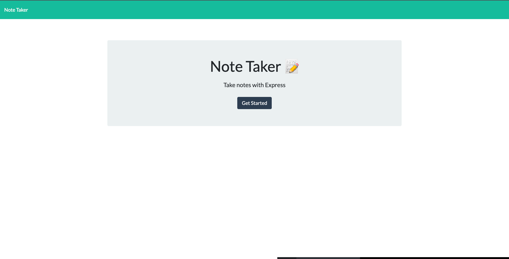
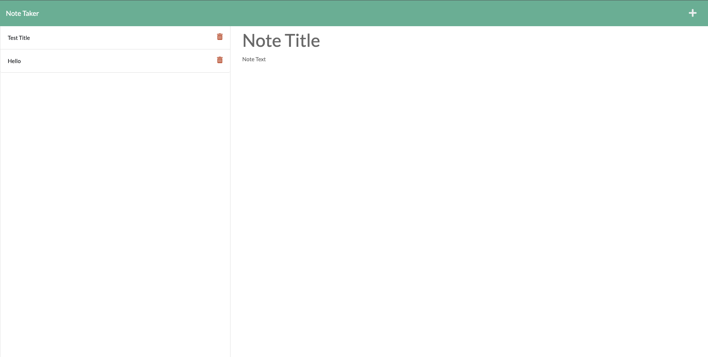

# Note-Taker

## Description 

GIVEN a note-taking application
WHEN user open the Note Taker
THEN user am presented with a landing page with a link to a notes page
WHEN user click on the link to the notes page
THEN user am presented with a page with existing notes listed in the left-hand column, plus empty fields to enter a new note title and the note’s text in the right-hand column
WHEN user enter a new note title and the note’s text
THEN a Save icon appears in the navigation at the top of the page
WHEN user click on the Save icon
THEN the new note I have entered is saved and appears in the left-hand column with the other existing notes
WHEN user click on an existing note in the list in the left-hand column
THEN that note appears in the right-hand column
WHEN user click on the Write icon in the navigation at the top of the page
THEN user am presented with empty fields to enter a new note title and the note’s text in the right-hand column

## Screenshot

## Technologies used:

Built with express.js and deployed with Heroku.

## LINKS

[Heroku App](https://warm-harbor-34067.herokuapp.com/)